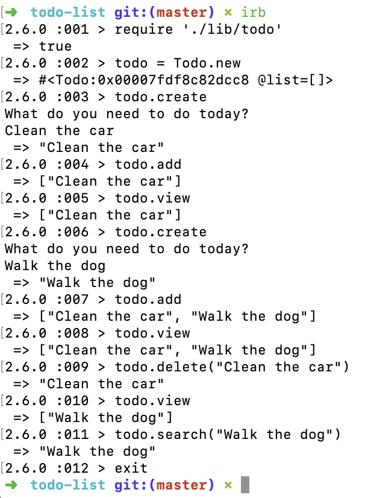

# To Do List

A small project to practice Ruby again after a few weeks programming in JavaScript.

## How to use this program
1. Clone this repo
2. Run bundle install
3. You run this program from the command line as follows:

<center></center>

## User Stories

```
As a busy person
So that I can keep track of my tasks
I would like to add a 'to do' to a list.

As a busy person
So that I can check what I have left to do
I would like to see all my current to dos.

As a busy person
So that I can delete a task once I have completed it
I would like to delete a specific to do.

As a busy person
So that I can see if I have already added something to my list
I would like to search for that item in my list.
```

## What I learned
* How to stub user input in my tests so I don't physically need to type them in myself:
```
before do
  allow($stdout).to receive(:write)
  allow(todo).to receive(:gets).and_return("Clean car\n")
end
```

## Acknowledgments
Jordan Roberts
